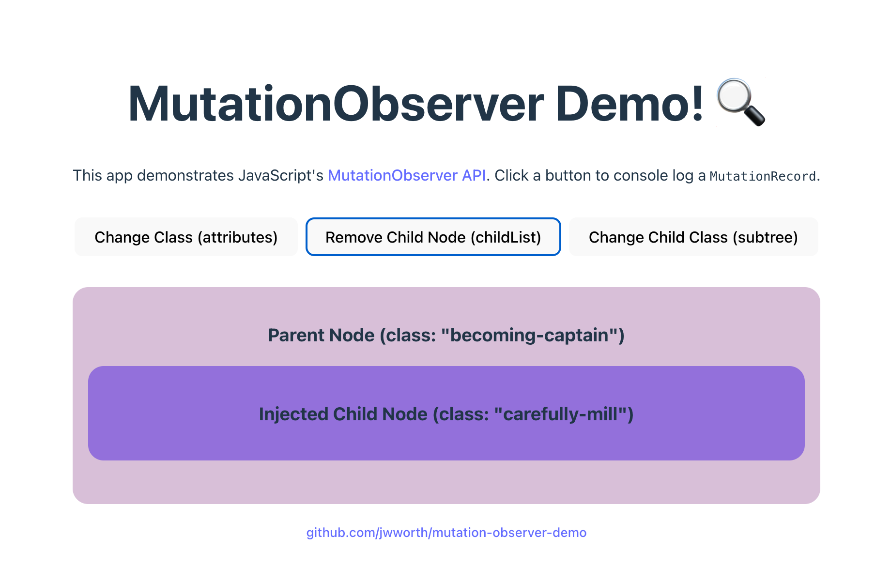

# Mutation Observer Demo

The purpose of this application is to demonstrate JavaScript's [MutationObserver][docs] API and inspire practical applications.



Setup:

```
npm i
npm run dev
```

[docs]: https://developer.mozilla.org/en-US/docs/Web/API/MutationObserver
